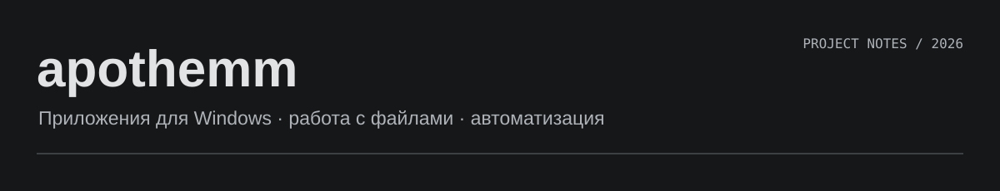

Привет, я apothemm. Учусь разработке на небольших инструментах для задач, с которыми сталкиваюсь за компьютером: разобрать файлы, посмотреть изменения, найти ошибку в логах.

Основная практика — **Python и C#**. C++, Go, Rust и TypeScript пробую в отдельных проектах. Репозитории ниже — личные учебные работы, созданные с помощью ИИ; это не коммерческий опыт.

### С чего начать

**[VaultTrail](https://github.com/apothemm/vault-trail)** · C# / .NET  
Снимки каталогов с хранением одинаковых файлов в одном экземпляре. Есть сравнение версий, проверка целостности и восстановление с предварительным просмотром. В [описании архитектуры](https://github.com/apothemm/vault-trail/blob/main/docs/architecture.md) разобраны устройство хранилища и ограничения. Шифрования и копирования открытых системных файлов пока нет.

**[DiffSignal](https://github.com/apothemm/diffsignal)** · Python / FastAPI / SQLite  
Мониторинг изменений веб-страниц с историей версий, сравнением текста и REST API. Запускается на своём компьютере или сервере. Страницы, которым нужен JavaScript для отображения содержимого, требуют другого способа загрузки.

**[SortMate](https://github.com/apothemm/sortmate)** · Python / Tkinter  
Сортировка файлов по типу и месяцу. Перед перемещением показывает план, обрабатывает совпадения имён и хранит журнал для отмены.

**[WorkDesk](https://github.com/apothemm/workdesk)** · C++17 / Win32  
Задачи, заметки и таймер в одном Windows-приложении. Данные сохраняются локально. Есть [готовая сборка](https://github.com/apothemm/workdesk/releases/latest); интерфейс пока рассчитан на фиксированный размер окна.

### Другие проекты

| Проект | Что делает | Стек |
| --- | --- | --- |
| [LogWorkbench](https://github.com/apothemm/log-workbench) | Фильтрует текстовые логи и JSONL, формирует отчёт | C# |
| [CsvScout](https://github.com/apothemm/csv-scout) | Проверяет структуру CSV, кавычки и пустые поля | C++17 |
| [LinkPulse](https://github.com/apothemm/link-pulse) | Проверяет HTTP-адреса параллельно, сохраняет статусы и задержку | Go |
| [HashLedger](https://github.com/apothemm/hash-ledger) | Создаёт и проверяет манифесты SHA-256 | Rust |
| [RepoLens](https://github.com/apothemm/repo-lens) | Считает объём исходников и находит крупные файлы | TypeScript |
| [DupeRadar](https://github.com/apothemm/dupe-radar) | Ищет одинаковые файлы без удаления | Python |
| [SystemScope](https://github.com/apothemm/systemscope) | Показывает CPU, RAM, процессы и свободное место | C++17 / Win32 |
| [DiskLens](https://github.com/apothemm/disk-lens) | Анализирует занятое место в папках | Python / Tkinter |
| [SnippetShelf](https://github.com/apothemm/snippet-shelf) | Хранит текстовые шаблоны с тегами и переменными | Python / SQLite |
| [FocusHarbor](https://github.com/apothemm/focus-harbor) | Таймер фокуса и история сессий | Python / SQLite |
| [ShareSafe](https://github.com/apothemm/sharesafe) | Маскирует найденные секреты и личные данные в тексте | Python |
| [Windows First Aid](https://github.com/apothemm/windows-first-aid) | Собирает диагностику Windows для разбора проблемы | PowerShell / AI-skill |

### Над чем работаю

Продолжаю разбираться в тестировании, API и конкурентном выполнении задач. В проектах есть инструкции запуска и проверки через GitHub Actions. Ограничения описываю в README, чтобы перед использованием было понятно, чего ожидать.

Интересуют стажировки и junior-позиции в разработке и автоматизации. Ошибки и идеи можно оставлять в Issues соответствующего проекта.
