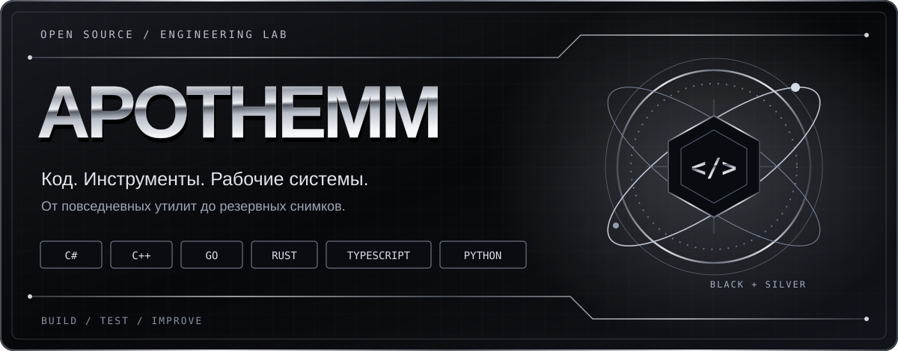

  

  <a href="#проекты">Проекты</a> &nbsp;·&nbsp;
  <a href="#технологии">Технологии</a> &nbsp;·&nbsp;
  <a href="#направление">Направление</a>

Развиваюсь в **Python-разработке** и создаю инструменты для повседневных задач: от приложений для Windows до автоматизации и работы с данными. Мне интересны понятные интерфейсы, локальная обработка и возможность быстро получить полезный результат.

## Проекты

<table>
<tr>
<td width="50%" valign="top">

### ◈ [DiskLens](https://github.com/modeAlohadance/disk-lens)
**Куда уходит место на диске?**

Анализ папок, список крупных файлов и распределение по типам. Сканирование с отменой и экспорт отчёта в CSV.

`Python` `Tkinter` `Threading`

[Исходники ↗](https://github.com/modeAlohadance/disk-lens) · [Скачать для Windows ↓](https://github.com/modeAlohadance/disk-lens/releases/latest)

</td>
<td width="50%" valign="top">

### ◇ [SnippetShelf](https://github.com/modeAlohadance/snippet-shelf)
**Нужные слова — всегда под рукой.**

Библиотека текстовых шаблонов с тегами и поиском. Подстановка переменных, копирование результата, импорт и экспорт JSON.

`Python` `Tkinter` `SQLite`

[Исходники ↗](https://github.com/modeAlohadance/snippet-shelf) · [Скачать для Windows ↓](https://github.com/modeAlohadance/snippet-shelf/releases/latest)

</td>
</tr>
<tr>
<td width="50%" valign="top">

### ◷ [FocusHarbor](https://github.com/modeAlohadance/focus-harbor)
**Время для одной важной задачи.**

Таймер фокусировки с паузами и перерывами. Журнал завершённых сессий, статистика за день и экспорт CSV.

`Python` `Tkinter` `SQLite`

[Исходники ↗](https://github.com/modeAlohadance/focus-harbor) · [Скачать для Windows ↓](https://github.com/modeAlohadance/focus-harbor/releases/latest)

</td>
<td width="50%" valign="top">

### ▦ [SortMate](https://github.com/modeAlohadance/sortmate)
**Порядок в папке начинается с плана.**

Сортировка файлов по типам или месяцам. Предпросмотр перемещений, обработка совпадающих имён и отмена последней операции.

`Python` `Tkinter` `Filesystem`

[Исходники и запуск ↗](https://github.com/modeAlohadance/sortmate#run-on-windows)

</td>
</tr>
<tr>
<td width="50%" valign="top">

### ⇄ [DiffSignal](https://github.com/modeAlohadance/diffsignal)
**Следить за изменениями на веб-страницах.**

Self-hosted сервис мониторинга: история версий, сравнение изменений, веб-интерфейс и REST API.

`Python` `FastAPI` `SQLite` `Docker`

[Посмотреть проект ↗](https://github.com/modeAlohadance/diffsignal)

</td>
<td width="50%" valign="top">

### ⌁ [ShareSafe](https://github.com/modeAlohadance/sharesafe)
**Подготовить текст перед отправкой.**

CLI для поиска и маскирования распространённых секретов и персональных данных в логах, конфигурациях и промптах. Обработка локально.

`Python` `CLI` `Text processing`

[Посмотреть проект ↗](https://github.com/modeAlohadance/sharesafe)

</td>
</tr>
</table>

Ещё один проект: **[Windows First Aid](https://github.com/modeAlohadance/windows-first-aid)** — AI-skill для первичной диагностики Windows с PowerShell-сборщиком отчёта.

## Технологии

В моих проектах используются:

  
  
  
  
  
  
  

Для FocusHarbor, SnippetShelf и DiskLens подготовлены инструкции, автоматические проверки и Windows-сборки. Для меня важно, чтобы проект можно было не только прочитать, но и запустить.

## Направление

Интересуют **стажировки и junior-позиции** в Python-разработке, автоматизации и создании инструментов для пользователей и разработчиков. Продолжаю изучать архитектуру приложений, тестирование и работу с API на практических проектах.

Идеи и замечания по приложениям можно оставить в **Issues соответствующего репозитория**.

---

Python tools · Desktop apps · Everyday automation

