

<b>LOCAL SOFTWARE · OPEN SOURCE · PRACTICAL ENGINEERING</b>

Практические проекты на **C#, C++, Go, Rust, TypeScript и Python**. Развиваюсь в разработке инструментов для повседневной работы: локальная обработка, понятные команды, проверяемое поведение.

<a href="#системы">Системы</a> &nbsp; / &nbsp; <a href="#утилиты">Утилиты</a> &nbsp; / &nbsp; <a href="#desktop">Desktop</a> &nbsp; / &nbsp; <a href="#технологии">Технологии</a>

## Системы

<table>
<tr>
<td width="50%"><a href="https://github.com/apothemm/vault-trail">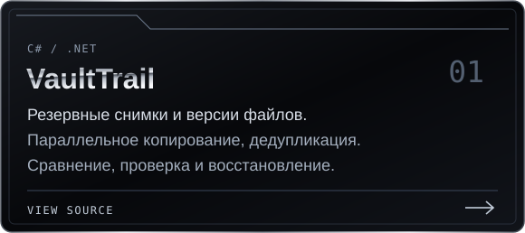</a></td>
<td width="50%"><a href="https://github.com/apothemm/diffsignal">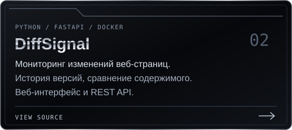</a></td>
</tr>
</table>

**[VaultTrail](https://github.com/apothemm/vault-trail)** — основной проект: параллельное создание резервных снимков, дедупликация, история, сравнение версий, проверка целостности и восстановление с предварительным просмотром.

[Архитектура ↗](https://github.com/apothemm/vault-trail/blob/main/docs/architecture.md) · [Запуск ↗](https://github.com/apothemm/vault-trail#запуск) · [Автоматические проверки ↗](https://github.com/apothemm/vault-trail/actions)

## Утилиты

<table>
<tr>
<td width="50%"><a href="https://github.com/apothemm/log-workbench">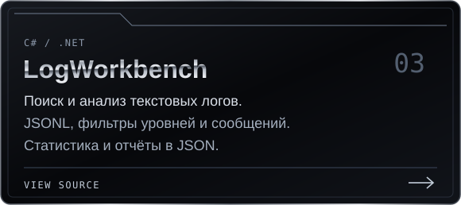</a></td>
<td width="50%"><a href="https://github.com/apothemm/csv-scout">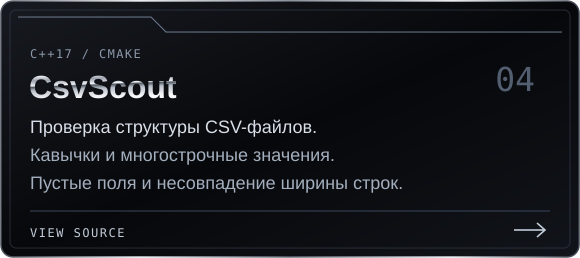</a></td>
</tr>
<tr>
<td width="50%"><a href="https://github.com/apothemm/link-pulse">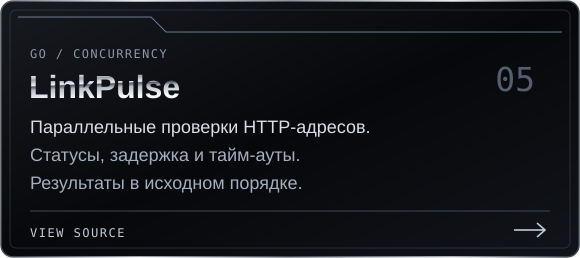</a></td>
<td width="50%"><a href="https://github.com/apothemm/hash-ledger">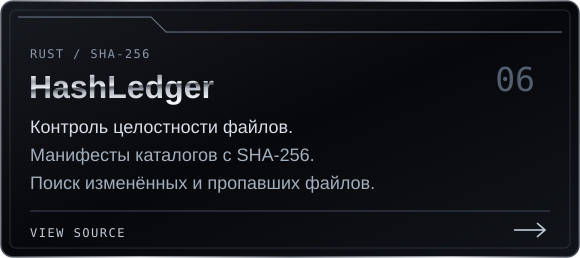</a></td>
</tr>
<tr>
<td width="50%"><a href="https://github.com/apothemm/repo-lens">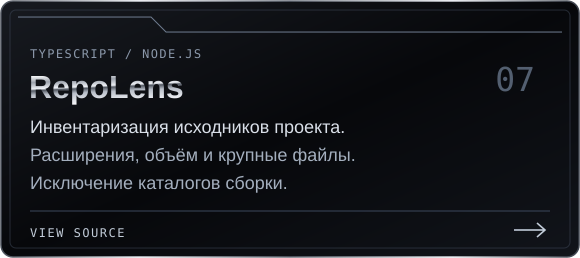</a></td>
<td width="50%"><a href="https://github.com/apothemm/dupe-radar">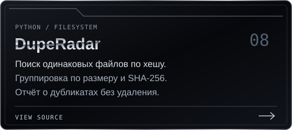</a></td>
</tr>
</table>

## Desktop

<table>
<tr>
<td width="50%"><a href="https://github.com/apothemm/workdesk">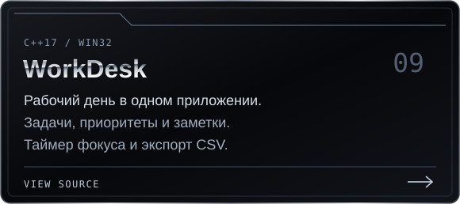</a></td>
<td width="50%"><a href="https://github.com/apothemm/systemscope">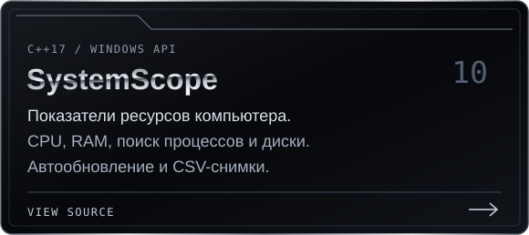</a></td>
</tr>
<tr>
<td width="50%"><a href="https://github.com/apothemm/disk-lens">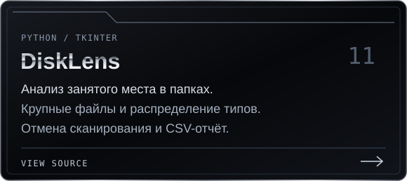</a></td>
<td width="50%"><a href="https://github.com/apothemm/snippet-shelf">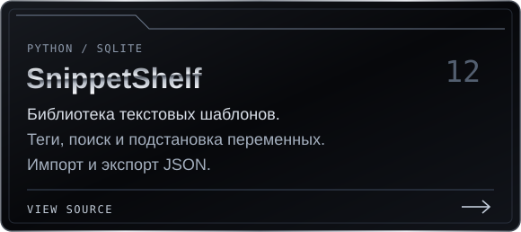</a></td>
</tr>
<tr>
<td width="50%"><a href="https://github.com/apothemm/focus-harbor">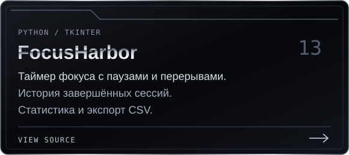</a></td>
<td width="50%"><a href="https://github.com/apothemm/sortmate">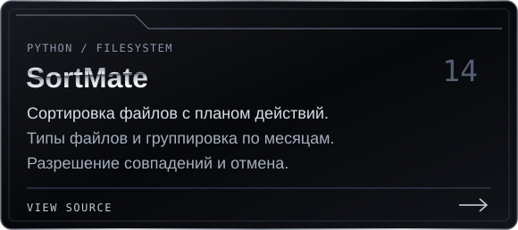</a></td>
</tr>
</table>

**Готовые Windows-сборки:** [WorkDesk](https://github.com/apothemm/workdesk/releases/latest) · [SystemScope](https://github.com/apothemm/systemscope/releases/latest) · [DiskLens](https://github.com/apothemm/disk-lens/releases/latest) · [SnippetShelf](https://github.com/apothemm/snippet-shelf/releases/latest) · [FocusHarbor](https://github.com/apothemm/focus-harbor/releases/latest).

**Ещё инструменты:** [ShareSafe](https://github.com/apothemm/sharesafe) — локальная маскировка секретов в тексте; [Windows First Aid](https://github.com/apothemm/windows-first-aid) — AI-skill с PowerShell-сборщиком диагностики.

## Технологии

В репозиториях есть инструкции запуска, тесты и автоматические проверки. Особенности и ограничения каждого инструмента описаны в README.

Интересуют **стажировки и junior-позиции** в разработке и автоматизации. Продолжаю изучать архитектуру, конкурентность, тестирование и работу с данными через практические проекты. Идеи и замечания — в Issues соответствующего репозитория.

